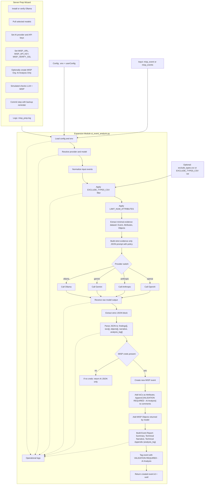
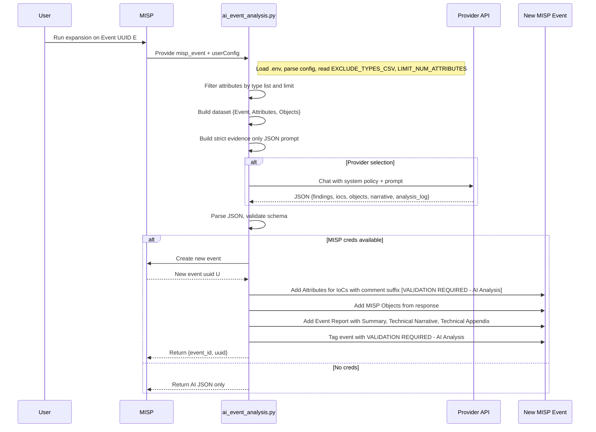

# MISP AIModule


```
.
├── README.md
├── dev_misp_builder
│   ├── README.md
│   └── misp_dev_builder_installer_hardened.sh
├── modules
│   └── expansion
│       └── ai_event_analysis.py
├── requirements.txt
├── sample_exclude_types.csv
└── tools
    └── misp_server_prep.py
```

## What it does

- Sends one or more MISP events to a selected LLM provider and requests evidence only analysis
- Creates a new MISP event holding IoCs, structured MISP Objects, and an Event Report
- The Event Report includes a Technical Appendix of analysis steps so reviewers can see how conclusions were drawn
- Tags new content with `VALIDATION REQUIRED - AI Analysis`

## System flow: preprocessing, analysis, and write-back


## Sequence: single run against one event



## Why a dedicated AI Org matters

You can create and use a dedicated MISP Organisation for AI outputs, for example `AI Analysis Only`. Only share events with this org that you want analyzed. This isolates AI generated content and gives you an explicit control gate.

## Install

While this *SHOULD* be production friendly, I highly recommend testing first on a development environment.


```bash
git clone https://github.com/haKC-ai/misp_ai_expansion_module.git
cd misp-ai-expansion
./installer.sh --prep
````

* `--prep` launches the server prep wizard described below.

## MISP Server Prep wizard

Run anytime:

```bash
. ./.venv/bin/activate
python tools/misp_server_prep.py
```

Capabilities:

* Install or verify Ollama, and pull selected models
* Set AI provider and API keys into `.env`
* Set `MISP_URL`, `MISP_API_KEY`, `MISP_VERIFY_SSL`
* Optionally create a new Organisation in MISP, default name `AI Analysis Only`
* Simulated checks: validates LLM connectivity and MISP connectivity without mutating data
* Commit step with a reminder to back up first
* All actions are logged to `misp_prep.log`

## Config

`.env` keys:

```
AI_PROVIDER=openai|anthropic|gemini|ollama
OPENAI_API_KEY=...
ANTHROPIC_API_KEY=...
GOOGLE_API_KEY=...
OLLAMA_HOST=http://127.0.0.1:11434
...
MISP_URL=https://your.misp.local
MISP_API_KEY=...
MISP_VERIFY_SSL=true
```

Limiters:

* `LIMIT_NUM_ATTRIBUTES` optional integer
* `EXCLUDE_TYPES_CSV` optional CSV of attribute types to omit

Example:

- Say you don’t want attachments or malware samples analyzed:
```
attachment,malware-sample
```

- Skip large blobs and crypto artifacts:
```
attachment,malware-sample,x509-fingerprint-md5,x509-fingerprint-sha1,x509-fingerprint-sha256
```

`Key details`

- The strings must match official MISP attribute type names exactly (case-sensitive).

 -- There are no headers, no quotes, just a flat CSV string.
 -- You put this in the module config (or in .env as EXCLUDE_TYPES_CSV=...).

 -- Reference for valid names

 -- The full list of valid attribute types is maintained in the MISP core docs:
https://www.misp-project.org/datamodels/#attributes

## Running the expansion module

Invoke via MISP expansion on an event or API call with `misp_event` or `misp_events`. The module returns the new event id and uuid when MISP credentials are present.

## Output contents

* New event with tag `VALIDATION REQUIRED - AI Analysis`
* IoCs as attributes, each attribute comment includes `[VALIDATION REQUIRED - AI Analysis]`
* Structured MISP Objects when returned by the model
* Event Report titled `AI Technical Analysis Report` with sections:

  * Summary
  * Technical Narrative
  * Technical Appendix listing analysis steps

## Disclaimer

Use of AI must be operator controlled and audited. Keep AI access scoped by placing events into the dedicated AI Organisation only when you intend to analyze them. Always validate outputs. Back up your MISP before committing configuration changes.

## Security practices

* Evidence only prompt
* Temperature 0
* Strict timeouts
* No external lookups
* Keys never logged in plaintext

