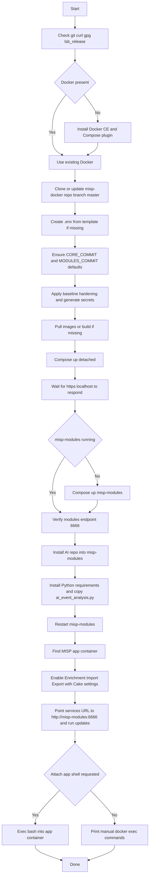

# MISP AIModule Dev Environment Installer

```
___  ________ ___________    ___  ________  ___          _       _      
|  \/  |_   _/  ___| ___ \  / _ \|_   _|  \/  |         | |     | |     
| .  . | | | \ `--.| |_/ / / /_\ \ | | | .  . | ___   __| |_   _| | ___ 
| |\/| | | |  `--. \  __/  |  _  | | | | |\/| |/ _ \ / _` | | | | |/ _ \
| |  | |_| |_/\__/ / |     | | | |_| |_| |  | | (_) | (_| | |_| | |  __/
\_|  |_/\___/\____/\_|     \_| |_/\___/\_|  |_/\___/ \__,_|\__,_|_|\___|
```

A hardened installer script to spin up a local **MISP stack with Docker**, enable misp-modules, install your AI expansion into the misp-modules container, wire the MISP app to use it, and optionally drop you into the app container.

It also supports **destroy mode** to safely tear down the dev instance, clean containers/volumes, and optionally remove Docker if this script installed it.

Repo script name: `misp_dev_environment`


## What it sets up

* Installs `git` and Docker CE if missing (Ubuntu/Debian).
* Clones `github.com/MISP/misp-docker` (branch `master`).
* Ensures `.env` exists with required defaults (`CORE_COMMIT`, `MODULES_COMMIT`).
* Applies baseline hardening by generating random secrets and writing them to `misp_secure_credentials.txt`.
* Builds images if upstream does not define them.
* Pulls images and starts the stack with Docker Compose.
* Waits for `https://localhost` to respond.
* Ensures the `misp-modules` container is running and reachable at port 6666.
* Installs your AI expansion module into the `misp-modules` container and restarts it.
* Enables **Enrichment, Import, and Export** modules in the MISP app (via Cake).
* Optionally clones your AI repo inside the MISP app container and attaches an interactive bash shell.


## Prerequisites

* Linux host (tested on Ubuntu 24.04).
* User can run `sudo` for package installs.
* Internet access to pull Docker images and GitHub repos.


## Quick start

```bash
chmod +x misp_dev_environment
./misp_dev_environment
```

Auto clone your AI repo into the app container and attach a shell:

```bash
AUTO_CLONE_INSIDE_APP=true AUTO_ATTACH_APP_SHELL=true ./misp_dev_environment
```

Custom checkout locations and longer timeout:

```bash
TARGET_DIR=/opt/misp-docker \
WAIT_TIMEOUT=600 \
LOG_FILE=/var/log/misp_dev_environment.log \
./misp_dev_environment
```

Destroy dev instance (containers, volumes, logs):

```bash
ACTION=destroy ./misp_dev_environment
```

Destroy and also uninstall Docker if the script installed it:

```bash
ACTION=destroy DOCKER_UNINSTALL=true ./misp_dev_environment
```


## Default access

* URL: [https://localhost](https://localhost)
* Generated credentials are saved in `misp_secure_credentials.txt`.
  **Change them immediately.**


## Environment knobs

Set as env vars before running the script.

**Core settings**

* `REPO_URL` MISP docker repo (default `https://github.com/MISP/misp-docker`).
* `TARGET_DIR` checkout directory (default `misp-docker`).
* `GIT_BRANCH` branch to use (default `master`).
* `WAIT_TIMEOUT` wait for MISP to answer in seconds (default 300).
* `LOG_FILE` log path (default `./misp_dev_environment.log`).

**AI module install**

* `AI_REPO_URL` AI module repo (default [misp\_ai\_expansion\_module](https://github.com/haKC-ai/misp_ai_expansion_module)).
* `AI_WORKDIR` path inside misp-modules (default `/opt/misp-ai-expansion`).
* `AI_MODULE_REL` module path inside repo (default `modules/expansion/ai_event_analysis.py`).
* `AI_REQS_REL` requirements file (default `requirements.txt`).

**Clone/attach inside app container**

* `AUTO_CLONE_INSIDE_APP` true to clone AI repo inside app container (default `true`).
* `AUTO_ATTACH_APP_SHELL` true to attach interactive shell at end (default `true`).
* `INSIDE_APP_CLONE_DIR` clone path in app container (default `/opt/misp-ai-expansion`).

**Hardening**

* `HARDEN_BASELINE` (default `true`) → generate secrets, set strong defaults.
* `HARDEN_TLS` (default `false`) → enable Caddy reverse proxy with Let’s Encrypt.
* `PUBLIC_DOMAIN`, `ACME_EMAIL` → required if `HARDEN_TLS=true`.
* `HARDEN_UFW` (default `false`) → enable UFW and allow only 22, 80, 443.

**Destroy**

* `ACTION=destroy` → teardown containers, volumes, logs.
* `DOCKER_UNINSTALL=true` → also uninstall Docker CE if installed by script.
* `NONINTERACTIVE=true` → skip confirmations.


## Installer flow




## Common commands

Attach to MISP app container:

```bash
docker exec -it $(docker ps --filter label=com.docker.compose.service=misp --format '{{.ID}}' | head -n1) bash
```

Attach to misp-modules:

```bash
docker exec -it $(docker ps --filter label=com.docker.compose.service=misp-modules --format '{{.ID}}' | head -n1) bash
```

Restart containers:

```bash
docker compose restart misp misp-modules
```

Destroy dev instance:

```bash
ACTION=destroy ./misp_dev_environment
```


## Security notes

* This is a **developer environment**. Not production-ready.
* All defaults are replaced with strong random secrets, stored in `misp_secure_credentials.txt`.
* Use firewall rules, TLS, and strong API keys.
* Keep logs (`misp_dev_environment.log`) for audit.
* Use `ACTION=destroy` to safely clean up.


Do you want me to also include a **side-by-side "dev vs destroy" mermaid diagram** (so it’s visually clear what happens in each mode)? That could make the README even sharper.
