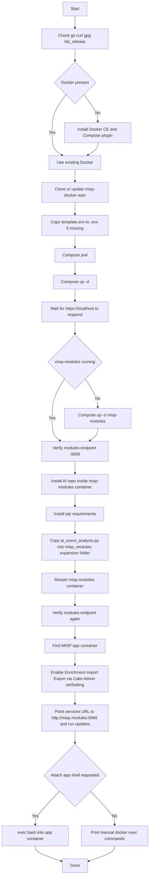
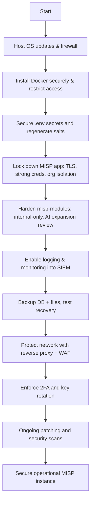

# MISP AIModule Dev Environment Installer

```
___  ________ ___________    ___  ________  ___          _       _      
|  \/  |_   _/  ___| ___ \  / _ \|_   _|  \/  |         | |     | |     
| .  . | | | \ `--.| |_/ / / /_\ \ | | | .  . | ___   __| |_   _| | ___ 
| |\/| | | |  `--. \  __/  |  _  | | | | |\/| |/ _ \ / _` | | | | |/ _ \
| |  | |_| |_/\__/ / |     | | | |_| |_| |  | | (_) | (_| | |_| | |  __/
\_|  |_/\___/\____/\_|     \_| |_/\___/\_|  |_/\___/ \__,_|\__,_|_|\___|
```

A single script to spin up a local MISP stack with Docker, enable misp-modules, install your AI expansion into the misp-modules container, wire the MISP app to use it, and optionally drop you into the app container to finish setup.

Repo script name: `misp_dev_environment`

## What it sets up

* Installs git and Docker CE if missing on Ubuntu or Debian
* Clones `github.com/MISP/misp-docker`, copies `template.env` to `.env`
* Pulls images and starts the stack with Docker Compose
* Waits for `https://localhost` to respond
* Ensures the misp-modules container is running and reachable on 6666
* Installs your AI expansion into the misp-modules container
* Enables Enrichment, Import, and Export modules in MISP app and points them at misp-modules
* Optional: clones your installer repo inside the MISP app container and attaches an interactive bash

## Prerequisites

* Linux host, tested on Ubuntu 24.04 and Debian derivatives
* User can run `sudo` for package installs
* Internet access to pull Docker images and git repos

## Quick start

```bash
chmod +x misp_dev_environment
./misp_dev_environment
```

Auto clone your AI repo into the app container and attach a shell

```bash
AUTO_CLONE_INSIDE_APP=true AUTO_ATTACH_APP_SHELL=true ./misp_dev_environment
```

Custom locations

```bash
TARGET_DIR=/opt/misp-docker \
LOG_FILE=/var/log/misp_dev_environment.log \
./misp_dev_environment
```

## Default access

* URL: [https://localhost](https://localhost)
* Change default credentials on first login

## Environment knobs

Set as env vars before running the script.

* `REPO_URL` MISP docker repo. Default [https://github.com/MISP/misp-docker](https://github.com/MISP/misp-docker)
* `TARGET_DIR` checkout directory. Default misp-docker
* `GIT_BRANCH` branch to use. Default main
* `WAIT_TIMEOUT` seconds to wait for MISP to answer. Default 240
* `LOG_FILE` log path. Default `./misp_dev_environment.log`

AI module install into misp-modules container

* `AI_REPO_URL` your AI module repo. Default [https://github.com/haKC-ai/misp\_ai\_expansion\_module](https://github.com/haKC-ai/misp_ai_expansion_module)
* `AI_WORKDIR` path inside misp-modules container. Default /opt/misp-ai-expansion
* `AI_MODULE_REL` path to module file inside your repo. Default modules/expansion/ai\_event\_analysis.py
* `AI_REQS_REL` requirements file path. Default requirements.txt

Optional clone and attach inside MISP app container

* `AUTO_CLONE_INSIDE_APP` true to clone your repo into the app container. Default false
* `AUTO_ATTACH_APP_SHELL` true to attach bash to the app container at the end. Default false
* `INSIDE_APP_CLONE_DIR` clone path inside app container. Default /opt/misp-ai-expansion

## What the installer does



## Verify

Inside the misp-modules container

```bash
docker exec -it $(docker ps --filter label=com.docker.compose.service=misp-modules --format '{{.ID}}' | head -n1) bash
curl -s http://127.0.0.1:6666/modules | jq .
```

In MISP UI

* Administration -> Server Settings -> Plugin settings
* Ensure Enrichment services, Import services, Export services are enabled
* Services URL should point to `http://misp-modules:6666`

## Common commands

Attach to the MISP app container

```bash
docker exec -it $(docker ps --filter label=com.docker.compose.service=misp --format '{{.ID}}' | head -n1) bash
```

Attach to misp-modules

```bash
docker exec -it $(docker ps --filter label=com.docker.compose.service=misp-modules --format '{{.ID}}' | head -n1) bash
```

Restart containers

```bash
docker compose restart misp
docker compose restart misp-modules
```

## Troubleshooting

* Script fails on apt keys
  Run `sudo apt-get update` and retry. Corporate proxies may require additional apt settings.

* misp-modules endpoint does not respond
  Check container logs
  `docker logs $(docker ps --filter label=com.docker.compose.service=misp-modules --format '{{.ID}}' | head -n1)`

* Cannot reach [https://localhost](https://localhost)
  Verify ports in `misp-docker` `.env` and that no local service is binding 443. Try the server IP.

* Permission errors on Docker
  Add your user to the docker group and re-login
  `sudo usermod -aG docker "$USER"`

## Security notes

* This is a pre-hardened developer setup, because we all know you are going to forget about it after you are done testing. 
* Dont use this for production. 
* Keep the logs. The installer writes to `misp_dev_environment.log`.
* Limit who can reach the Docker host. If this is a shared lab, use firewall rules and change the defaults in `.env`.

## MISP Docker Environment Hardening Checklist

### 1. Host OS hardening

* [ ] Apply all security updates (`sudo apt update && sudo apt upgrade -y`).
* [ ] Enable automatic updates (`unattended-upgrades` on Ubuntu).
* [ ] Restrict SSH: disable root login, enforce key-based auth, change default port if possible.
* [ ] Enable a firewall (e.g., `ufw`) and only allow necessary ports (443/tcp for HTTPS, 22/tcp for SSH, block 80 unless redirecting to 443).
* [ ] Install `fail2ban` or equivalent for brute-force SSH protection.
* [ ] Disable password-based `sudo` if feasible (use strong keys).

### 2. Docker daemon security

* [ ] Add only trusted users to the `docker` group (docker = root).
* [ ] Configure the Docker daemon to use user namespaces (`/etc/docker/daemon.json`).
* [ ] Enforce resource limits on containers (`cpus`, `memory` in compose).
* [ ] Disable `--privileged` mode (none of these containers should need it).
* [ ] Configure logging driver (`json-file` with rotation or syslog).
* [ ] Run Docker rootless mode if possible for this host.

### 3. MISP application configuration

* [ ] Change **all defaults** in `.env` before going live:

  * `MISP_ADMIN_EMAIL`, `MISP_ADMIN_PASSPHRASE`
  * `MYSQL_ROOT_PASSWORD`, `MYSQL_PASSWORD`
  * `REDIS_PASSWORD`
  * `MISP_SALT`
* [ ] Regenerate cryptographic salts: `MISP_SALT` must be unique per instance.
* [ ] Use strong API keys for PyMISP and automation users.
* [ ] Configure SMTP (`POSTFIX_RELAY_*`) with authentication and TLS for outbound email.
* [ ] Enable HTTPS only, ensure TLS certs are valid (Let’s Encrypt or corporate CA).
* [ ] Create separate MISP Orgs for different trust boundaries (e.g., “AI Analysis Only”).
* [ ] Restrict sharing groups so AI org only sees what it must analyze.

### 4. misp-modules & AI expansion

* [ ] Ensure misp-modules is not exposed directly to the internet (bind only to Docker network, not host).
* [ ] Restrict MISP app to talk to misp-modules via internal Docker network only.
* [ ] Review `requirements.txt` for AI expansion module. Pin exact versions, verify hashes (use `pip-tools` or `pip install --require-hashes`).
* [ ] Run AI modules with **temperature=0** to avoid speculation (already coded in).
* [ ] Tag all AI-generated content with `VALIDATION REQUIRED - AI Analysis` to enforce analyst review.
* [ ] Limit attribute export: use `EXCLUDE_TYPES_CSV` to prevent sensitive or oversized attributes leaving the system.

### 5. Container runtime security

* [ ] Scan Docker images with `trivy` or similar before use.
* [ ] Enable AppArmor or SELinux profiles for containers.
* [ ] Use `read_only: true` for containers that don’t need writes (not always possible with misp).
* [ ] Use `tmpfs` mounts for `/tmp` and other scratch dirs inside containers.

### 6. Monitoring & logging

* [ ] Redirect MISP and misp-modules logs to the host (volumes).
* [ ] Enable log rotation on host (`logrotate`).
* [ ] Monitor Docker logs with a SIEM or syslog collector.
* [ ] Enable MISP audit logging (check Server Settings → Security).
* [ ] Track API key usage and review regularly.

### 7. Backup & disaster recovery

* [ ] Back up database (MySQL/MariaDB) regularly.
* [ ] Back up uploaded files (attachments, malware-samples).
* [ ] Keep `.env` (minus secrets) and docker-compose files in Git for reproducibility.
* [ ] Encrypt backups at rest and in transit.
* [ ] Test restoration in a sandbox to validate backup integrity.

### 8. Network-level protections

* [ ] Place MISP behind a reverse proxy (nginx/Traefik) with WAF rules (e.g., ModSecurity CRS).
* [ ] Use Cloudflare/NGFW or equivalent to filter inbound traffic if exposing to the internet.
* [ ] Rate-limit login attempts on the proxy.
* [ ] Force HSTS headers for TLS.

### 9. Access control

* [ ] Create dedicated user accounts; disable or delete the bootstrap admin once new admins exist.
* [ ] Use strong 2FA for all users (Google Authenticator, YubiKey).
* [ ] Limit analyst API keys by role/org.
* [ ] Regularly review and revoke stale keys.

### 10. Continuous maintenance

* [ ] Keep `misp-docker` repo up to date (`git pull && docker compose pull`).
* [ ] Patch misp-modules and expansion modules regularly.
* [ ] Periodically rotate secrets (`MYSQL_PASSWORD`, `MISP_SALT`, API keys).
* [ ] Run security scans (e.g., Lynis, CIS benchmarks).
* [ ] Document your changes for reproducibility.


## Mermaid overview of hardening workflow




